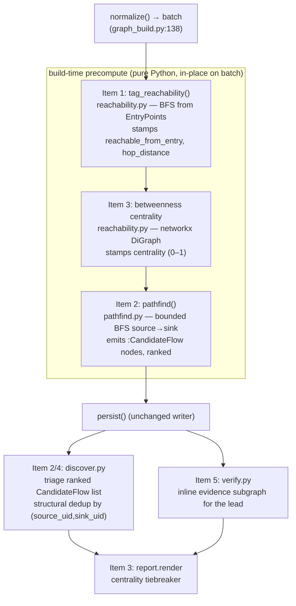

# Graph-grounded discovery & verification — 5-item roadmap

## Context

Orion's discovery agents treat the whole code graph as an undifferentiated search space: shape-A
hand-writes variable-length `FLOWS_TO` Cypher and explores blind, and the verifier re-derives every
lead from scratch across N files. Two concrete failures fall out of this:

- **`max_turns` ERRORs.** The apex 4-file RCE returned ERROR on the default verify budget and only
  surfaced on a manual re-run. Raising `VERIFY_MAX_TURNS` to 25 papered over the cause — agents burn
  turns rediscovering flows blindly.
- **Heuristic ranking/dedup.** `report.render` ranks by `(decision, lead.index)`; `discover._dedup`
  keys on `(shape, text[:80])` — lexical, so two agents describing one flow in different words
  double-count.

The fix: precompute graph structure **once at build time, in Python**, persist it as graph data, and
feed agents concrete ranked structured inputs — turning "agent explores a graph" into "agent judges a
shortlist." The user has approved building **all 5 items**.

### Design principles (all 5 items)

1. **Precompute in Python at build time; persist as graph data.** Mutate the in-memory `schema.Batch`
   after `joern_adapter.normalize` and before `persist.persist`. Confirmed safe: `persist._node_create`
   does `SET n += row.props` (`persist.py:64`) and `_node_rows` unions props by `NODE_KEY`
   (`persist.py:80-96`), so stamping new props onto the `batch.nodes` dicts in place persists with **no
   schema-key or persist change**. New node labels (`:CandidateFlow`) need one line in `schema.NODE_KEY`.
2. **No APOC / no GDS.** All traversal/centrality is pure Python over `batch.edges` (hand-rolled BFS +
   `networkx`). Pin `networkx` as a direct dep.
3. **Soft signal, never a hard filter (locked).** The arrow-function `CONTAINS_CALL` gap means the call
   graph marks some reachable code unreachable. Discovery *prioritizes* reachable code but may still
   explore; the verifier treats unreachable as a *downgrade* signal, never auto-REJECT. Reachability
   never drops a lead.
4. **Behavior-preserving for taint.** Nothing touches `FLOWS_TO` construction. Tripwire
   `tests/test_stream_build.py::test_stream_flows_parity` stays at 217. Confirmed non-interacting: that
   test counts flows off the *envelope* / `flows_count`, and reachability only adds node props.

### Data-model facts this plan relies on (confirmed in code)

- `batch.nodes: list[tuple[label, props_dict]]`; `batch.edges: list[tuple[rtype, from_label, from_key,
  to_label, to_key, props]]` (`schema.py:43-44`). Edge keys are dicts, e.g. `{"full_name": m}` /
  `{"uid": c}`, with `scan_id` stamped in.
- Node identity: `CpgMethod`→`full_name`, `CpgCall`→`uid` (`schema.NODE_KEY`). Props dicts in
  `batch.nodes` are the *same objects* persisted, so in-place mutation is the persist path.
- Relevant edges for the call/data graph: `CpgMethod -CONTAINS_CALL-> CpgCall`,
  `CpgCall -RESOLVES_TO-> CpgMethod`, `CpgCall -FLOWS_TO-> CpgCall`, `EntryPoint -ENTERS_AT-> CpgMethod`
  (`joern_adapter.py:469-500`).
- Single hook point: `graph_build.build` produces `batch` at `graph_build.py:135-138` (both stream and
  legacy converge here), then optionally spawns the `on_batch` thread (`:139-154`), then `persist`
  (`:155/158`). Reachability/pathfinding must mutate `batch` **before** the `on_batch` thread starts to
  avoid a read/write race — i.e. insert immediately after line 138.

### Build order



Dependency logic: **#1 is the foundation.** #2 turns reachability into concrete `(source, sink)`
`:CandidateFlow` endpoints; once leads reference those, #3 (rank by centrality), #4 (dedup by shared
endpoints) and #5 (evidence subgraph) are cheap. Order: **1 → 3(centrality) → 2 → {4, 5}**, with
report ranking (#3b) last. Land all on branch `graph-precompute`.

---

## Item 1 — Entry-point reachability pruning (foundation)

**New `orion/graph/reachability.py`** — pure, no I/O:

```python
def tag_reachability(batch: schema.Batch) -> dict:
    # Adjacency over batch.edges by node identity (CpgMethod->full_name via from_key/to_key["full_name"],
    # CpgCall->uid via ["uid"]):
    #   CONTAINS_CALL: method_full_name -> call_uid
    #   RESOLVES_TO:   call_uid        -> method_full_name
    #   FLOWS_TO:      call_uid        -> call_uid
    # Sources = to_key["full_name"] of every ENTERS_AT edge (the entry methods).
    # Multi-source BFS -> min hop distance per reached method/call.
    # Default every CpgMethod/CpgCall props: reachable_from_entry=False, hop_distance=-1.
    # Then stamp reached ones in place: reachable_from_entry=True, hop_distance=<hops>.
    # Return {"reached_methods","reached_calls","total_methods","total_calls"}.
```

Build a `{identity -> props_dict}` map from `batch.nodes` (methods keyed by `props["full_name"]`, calls
by `props["uid"]`), default all CpgMethod/CpgCall props, BFS from entry methods over the adjacency,
then write `reachable_from_entry`/`hop_distance` onto the mapped props dicts (mutates `batch.nodes`
in place → persisted via `SET n += row.props`).

**Hook** in `graph_build.build`, immediately after `batch` is assigned (`graph_build.py:138`, before
the `on_batch` block at `:139`), wrapped in `_timed(on_event, "reachability", ...)` so the split lands
in `progress.jsonl`. Applies to both stream and legacy paths (both produce `batch` here).

**Schema-of-record doc sync** (props are dynamic but must be advertised to agents):
- `strategies.py::SCHEMA` (`strategies.py:15-40`) — add `reachable_from_entry, hop_distance` to the
  `:CpgMethod` and `:CpgCall` lines + a one-line soft-signal note.
- `verify.py::_SCHEMA_BLOCK` (`verify.py:54-72`) — same additions, kept in sync.
- `README.md` — add the two props to the "How it works" schema description.

**Discovery consumption** — in `strategies.py` shape A `_SHAPE_TEXT["A"]`, add: "Prefer methods/calls
with `reachable_from_entry = true` and low `hop_distance`; a sink no EntryPoint can reach is usually
not exploitable — but the graph under-links arrow-function calls, so treat this as a priority hint,
not a hard filter."

**Verifier consumption** — in `verify.py::VERIFY_SYSTEM` (`verify.py:74-94`) add an exploitability
rule: "If the lead's sink has `reachable_from_entry = false`, weigh that against exploitability and
lean INCONCLUSIVE/REJECT — but do NOT auto-REJECT on it alone (arrow-function calls are under-linked);
confirm reachability against real source first."

**Tests** — `tests/test_reachability.py` (token-free, infra-free), following the `_synthetic_batch`
pattern (`test_persist_chunked.py:60-75`): entry method → call → resolved method → nested call, plus an
orphan subgraph. Assert hop distances, reachable set, orphan = `hop_distance -1 / reachable False`, and
idempotence (running twice yields identical props).

---

## Item 3a — Betweenness centrality (built alongside #1, feeds #2)

**In `reachability.py`** add `tag_centrality(batch) -> dict`: build the *reachable* call graph as a
`networkx.DiGraph` (nodes = call/method identities, edges = the same CONTAINS_CALL/RESOLVES_TO/FLOWS_TO
adjacency), compute betweenness centrality (`networkx.betweenness_centrality`, with `k`-sample
approximation when node count exceeds a threshold, e.g. 2000, for large repos), normalize 0–1, and
stamp `centrality` onto the matching CpgMethod/CpgCall props in place. Return a small summary.

**Hook** right after `tag_reachability` in `graph_build.build`, in its own `_timed(..., "centrality")`.
Add `centrality` to the two schema-of-record blocks (strategies + verify) and README alongside the
reachability props. Extend `test_reachability.py` to assert a chokepoint node scores strictly higher
than a leaf.

---

## Item 2 — Source→sink pathfinding as first-class data (the hinge)

**New `orion/graph/pathfind.py`**: bounded-depth BFS over the in-memory `FLOWS_TO` graph from each
source to a curated sink set.
- **Sources**: `FLOWS_TO` self-loops (`src_uid == dst_uid`) + calls inside EntryPoint methods
  (reachable via the CONTAINS_CALL adjacency from ENTERS_AT targets — reuse the adjacency built in #1).
- **Sink set**: a profile-aware category map added to `graph/profiles.py` as a new `Profile` field
  (e.g. `sink_categories: dict[str, tuple[str,...]]` — exec/query/template/redirect/fetch/deserialize
  name patterns), matched against `CpgCall.name`/`.code`. `EXPRESS`/`GENERIC` already carry `sink_hints`
  (`profiles.py:56-83`) — reuse/extend that vocabulary rather than inventing a parallel map.
- Enumerate bounded candidate paths; rank by `(hop_distance from #1, sink severity, centrality from
  #3a)`.

**Persist**: emit a new label `:CandidateFlow {scan_id, uid, source_uid, sink_uid, sink_category,
path_uids (json string), rank}` via `batch.emit_node`, and add `"CandidateFlow": ("scan_id","uid")`
to `schema.NODE_KEY` (`schema.py:17-26`). No new edge types; agents fetch via `run_cypher`. Add
`:CandidateFlow` to both schema-of-record blocks.

**Discovery** (shape A): replace "follow FLOWS_TO by hand" with "triage this ranked `:CandidateFlow`
list — for each, confirm/deny it is a real vulnerable flow." Keep the free-form FLOWS_TO path as an
explicit fallback for flows the precompute misses (soft signal, principle #3).

**Hook** after centrality in `graph_build.build` (`_timed(..., "pathfind")`). **Tests**
`tests/test_pathfind.py`: synthetic batch with one true source→sink chain + one dead-end; assert the
`:CandidateFlow` node is emitted with correct `source_uid`/`sink_uid`/`path_uids` and ranking order.

---

## Item 3b — Centrality → report blast-radius tiebreaker

**`report.py::render`** (`report.py:19-45`): within a decision class, break the `lead.index` tie by the
sink's `centrality` (descending) so a bug on a high-traffic node ranks above one in a backwater.
Requires threading the sink's `centrality` onto the `Verdict` (add an optional
`sink_centrality: float = 0.0` field to `contracts.Verdict`, `contracts.py:28-34`) populated in
`verify.verify_lead` from the lead's `:CandidateFlow` sink, or a render-time lookup. Prefer the
contract field (keeps `report.py` dependency-free of the graph, per its module docstring).

---

## Item 4 — Structural dedup replacing lexical dedup

**`discover.py::_dedup`** (`discover.py:67-78`): when leads carry `:CandidateFlow` endpoints (from #2),
key dedup on structural `(source_uid, sink_uid)` instead of `(shape, text[:80])`. For near-duplicate
clusters, build a "leads-share-endpoints" graph and collapse via `networkx.connected_components`.
Keep the current lexical key as the fallback for leads with no structured endpoints (shapes B/C/D).
Requires leads to carry the endpoint ids — add optional `source_uid`/`sink_uid` (or a
`candidate_flow_uid`) to `contracts.Lead` (`contracts.py:18-25`), populated by `discover._to_leads`
when the model cites a `:CandidateFlow`, extend `strategies.LEADS_JSON_SCHEMA` (`strategies.py:99-117`)
so the agent can return it. **Tests** `tests/test_dedup_structural.py`: two leads, same
`(source_uid, sink_uid)`, different text → collapse to one; two leads with no endpoints → lexical
fallback still applies.

---

## Item 5 — Precomputed evidence subgraph for the verifier

**`verify.py::_lead_message`** (`verify.py:97-109`): when a lead carries a `:CandidateFlow`, extract the
source→sink path (`path_uids`) plus a bounded k-hop neighborhood (pure-Python BFS over persisted edges,
or a bounded variable-length `run_cypher` at verify time) and inline it as ready context — file/line
per node on the path — so the verifier stops rediscovering the flow blind across N files. Keep the
message trust-invariant intact (still only the lead's own fields + graph facts, never the discovery
transcript). **Tests** extend `verify` unit tests to assert the evidence block is included when a
CandidateFlow is present and omitted otherwise.

---

## Housekeeping

- Pin `networkx` as a direct dependency in `pyproject.toml` `[project].dependencies`
  (`pyproject.toml:6-9`).
- Update `agenda.md`: mark these 5 as the active roadmap; keep Semgrep/CodeQL baseline +
  NodeGoat-eval-capture + A9 below them.
- All work on branch `graph-precompute` (not `main`). Open a PR when done.

## Verification

**Runnable in this session (pure Python, no live infra):**
- New unit tests: `test_reachability.py`, `test_pathfind.py`, `test_dedup_structural.py`, plus the
  verify/report additions — all token-free and infra-free (synthetic `schema.Batch`).
- Full token-free suite: `pytest -m "not slow" -q` (currently 75 passing) — must stay green. (This
  container has no `.venv`; create one or use system Python + `pip install -e ".[dev]"` to run.)
- Taint parity tripwire logic: `test_stream_build.py::test_stream_flows_parity` — reachability adds
  only node props, so the 217 count is structurally unaffected.

**Requires the user's WSL box (Neo4j + Joern + `claude` CLI):**
- Build smoke: `orion scan fixtures/NodeGoat`; confirm `[build/timing] reachability:` / `centrality:` /
  `pathfind:` events appear and props populate (`run_cypher` for one reachable and one unreachable
  node; one `:CandidateFlow` node).
- Live taint parity: `test_stream_flows_parity` slow variant + `flows_count` still 217 on NodeGoat,
  1075 on PyGoat.
- **Money metric:** re-run the apex scan after #1+#2+#5 and diff the first-pass verdict mix in
  `examples/apex/findings.json` (was 2 CONFIRM / 1 REJECT / 3 ERROR). Target: the 4-file RCE CONFIRMs
  on the **first** pass, no reverify. Commit the new run beside the old as before/after evidence.
